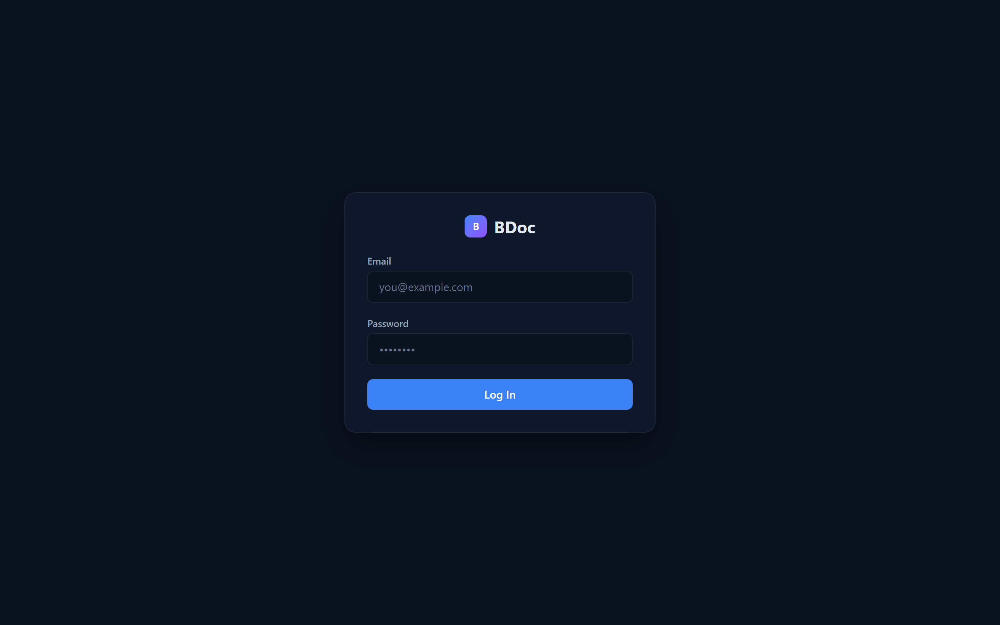
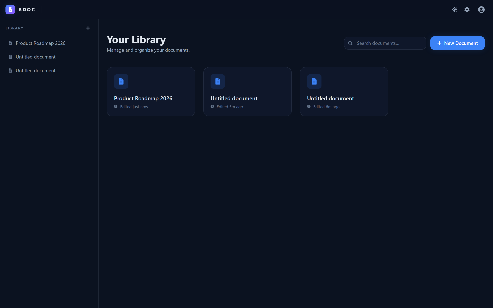
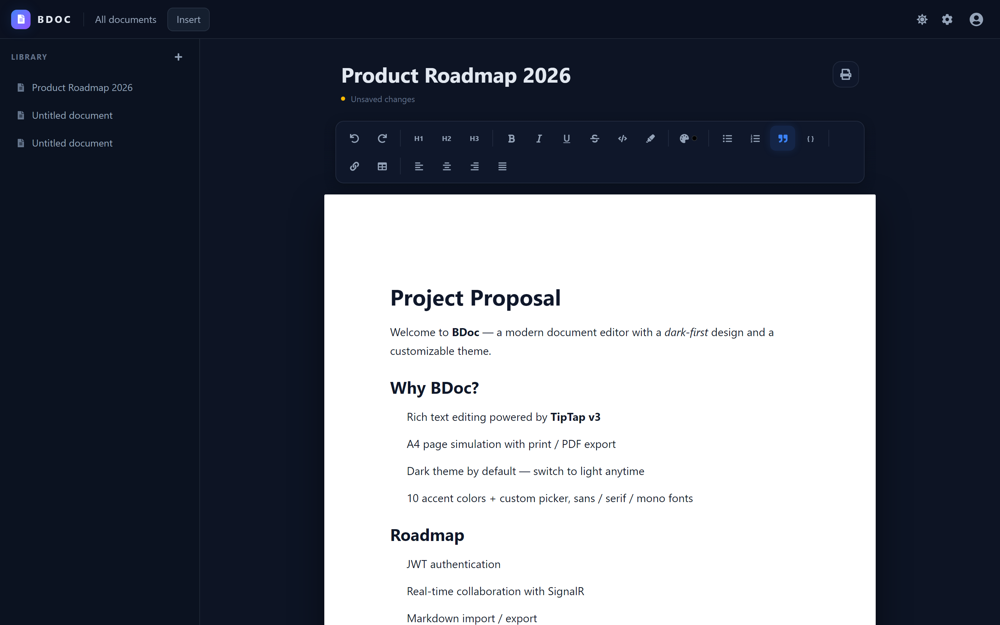
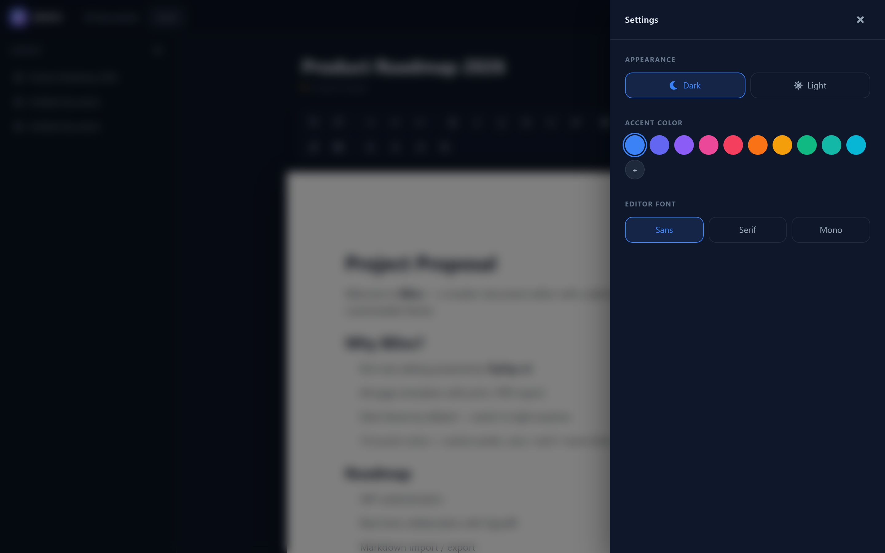
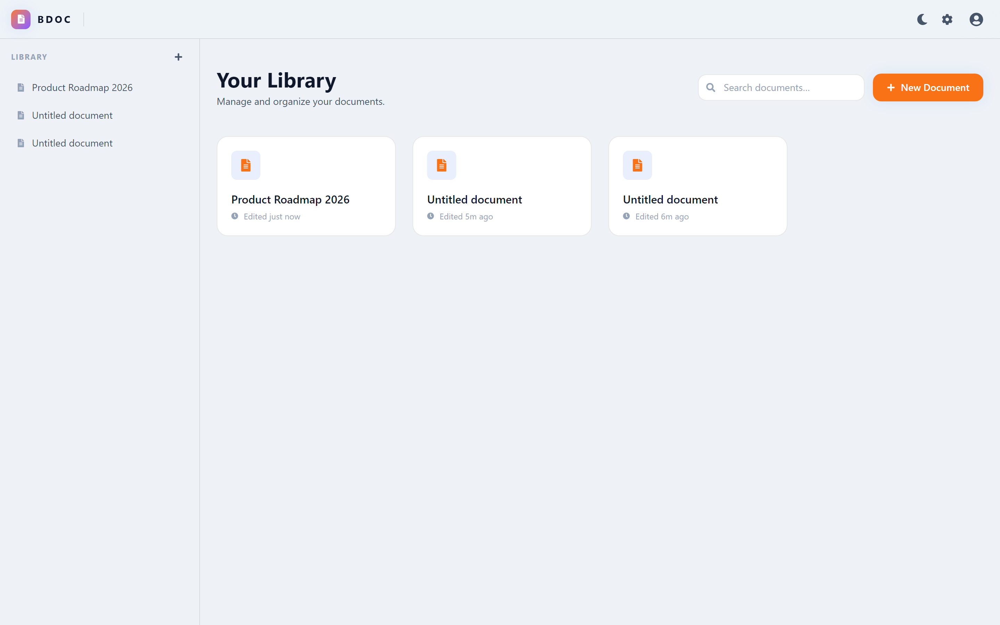
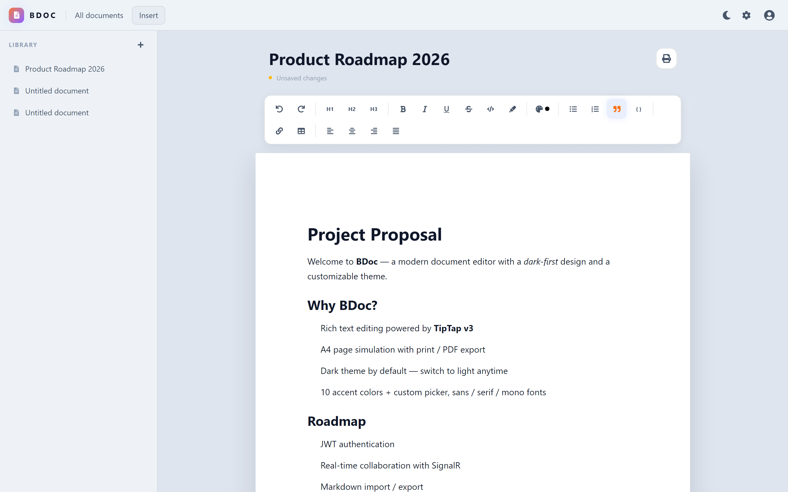

# 📝 BDoc — Modern Document Editor

A full-stack, Google-Docs-style document editor with a customizable dark-first UI.


## 📸 Demo

| Login | Document Library |
| :---: | :---: |
|  |  |

| Editor (dark) | Settings |
| :---: | :---: |
|  |  |

| Library (light) | Editor (light) |
| :---: | :---: |
|  |  |

## ✨ Features

- **Rich-text editing** (TipTap v3): headings, bold/italic/underline/strike, inline code, highlight, text color, lists, quotes, code blocks, tables, images, links, and alignment.
- **Word compatibility** — import `.docx` files and export documents as `.docx` (HTML ↔ OpenXML on the server). Import preserves fonts, font sizes, colors, highlight, bold/italic/underline/strike, alignment, nested lists, tables, images and links — ready for Microsoft Word / LibreOffice.
- **File menu** — a Word-style `File` menu in the header with New, Import Word, Download as Word, Print / Export to PDF and Close document.
- **Paragraph format** — per-paragraph line spacing, space before / after, left indent and first-line indent from a toolbar dropdown.
- **Page format** — a `Page` menu in the header sets paper size (A5/A4/A3/A2/A1), orientation (portrait/landscape) and margins (narrow/normal/wide). The document is rendered as discrete, paginated paper sheets sized to the chosen format (content flows across visible page breaks). Settings persist per document and are applied to the Word export.
- **Word document simulation** — A4 pages with editable margins, print / PDF export via the browser.
- **Dark theme by default**, fully customizable:
  - Light/dark toggle
  - Accent color (10 presets + custom picker)
  - Editor font (sans / serif / mono)
  - Preferences persist in `localStorage`.
- **Document library** backed by a real REST API — create, edit, autosave, delete.

## 🧱 Architecture

```
BDoc/
├── docker-compose.yml     # Full stack: postgres + backend + frontend
├── backend/               # ASP.NET Core 10 (Clean Architecture)
│   ├── BDoc.sln
│   ├── BDoc               # Web API host
│   ├── BDoc.Domain        # Entities & interfaces
│   ├── BDoc.Application   # Application layer
│   └── BDoc.Infrastructure# EF Core 10 + PostgreSQL, repositories, migrations
└── frontend/              # React 19 + Vite 8 + Tailwind 4 + TipTap 3
```

## 🚀 Quick Start (Docker)

```bash
docker compose up --build
```

- Frontend: http://localhost:5173
- Backend API: http://localhost:8080/api/documents (Swagger at `/swagger`)
- The API is proxied through the frontend under `/api`, so the UI never talks cross-origin in production.

Migrations are applied automatically on startup, and a Postgres 17 volume persists data between runs.

## 💻 Local Development

### Backend

Requires the **.NET 10 SDK** and a running Postgres.

```bash
cd backend
dotnet ef database update   # apply migrations (optional; app migrates on startup)
dotnet run                  # http://localhost:8080
```

### Frontend

```bash
cd frontend
npm install --legacy-peer-deps
npm run dev                 # http://localhost:5173 (proxies /api -> localhost:8080)
```

## 🛠️ Scripts

| Command               | Purpose                        |
| --------------------- | ------------------------------ |
| `docker compose up`   | Run the full stack             |
| `npm run dev`         | Vite dev server (frontend)     |
| `npm run build`       | Typecheck + production build   |
| `npm run lint`        | ESLint                         |
| `dotnet build`        | Build backend solution         |

## 🗺️ Roadmap

- JWT-based authentication
- Real-time collaboration (SignalR) & live cursors
- Markdown import/export